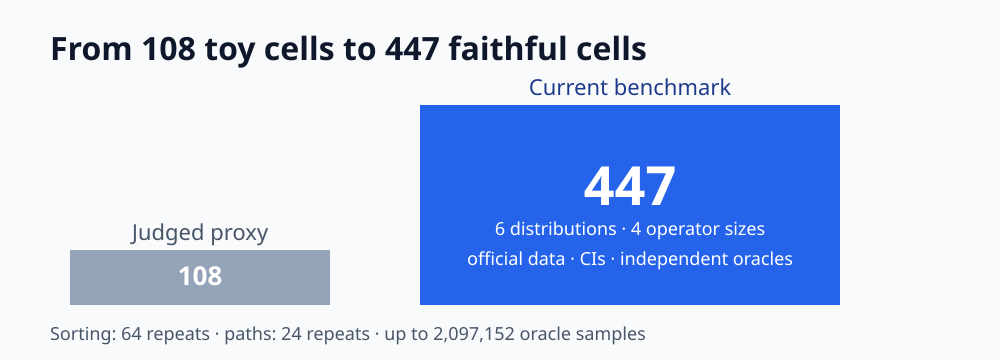
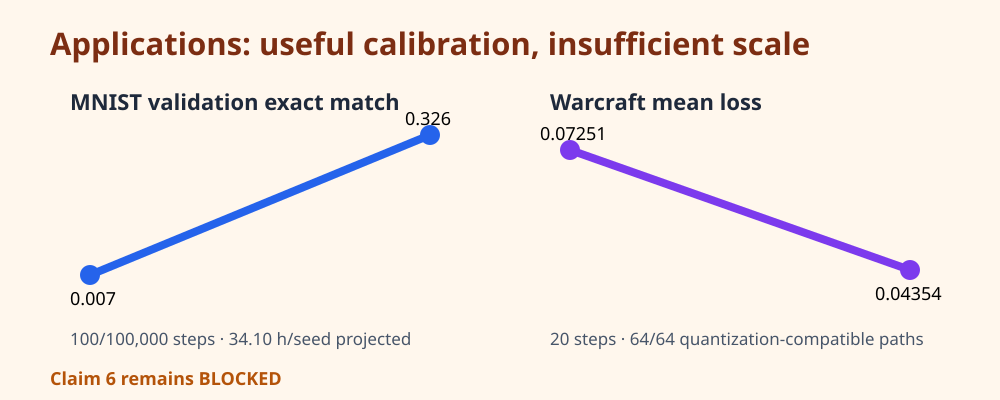
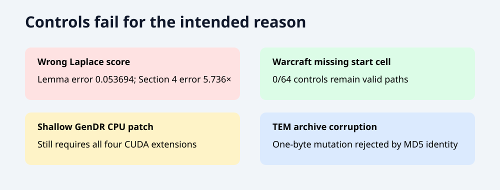
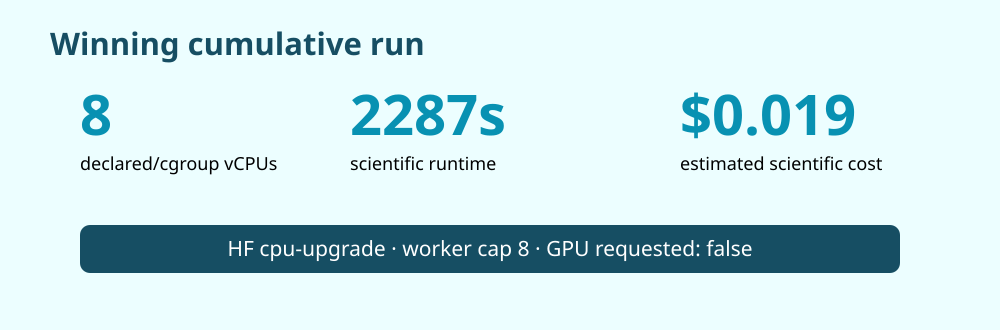

# Generalized stochastic smoothing: a claim-by-claim CPU reproduction

The paper asks whether nonsmooth algorithms can be differentiated by smoothing them with distributions beyond the usual Gaussian. We independently rebuilt its theorem checks and Section 4 estimator benchmark, then audited all four applications under a strict CPU-only constraint. The result is deliberately asymmetric: Claims 1–5 have direct reproducible evidence; the four-application Claim 6 is blocked rather than promoted from partial runs.

## What was implemented

The fixed entrypoint runs one cumulative path:

`quadrature / finite differences → 447-cell benchmark → MNIST calibration → Warcraft calibration → pinned GenDR audit → pinned TEM falsification audit → independent checkers`

Every node uses `uv sync --frozen --no-dev && .venv/bin/python -m repro.run`. Parameters live in committed code, seeds are fixed, and each child reruns accepted ancestors. The winning scientific commit is `75d1f2c6c76c2c642ba59319a097a79a4f5e504d`.

## The estimator benchmark is no longer a toy proxy

The judged baseline had one integrand at 64 samples. The current benchmark covers six perturbation distributions, sorting at two sizes, shortest paths at two sizes, official Warcraft inputs, all 447 feasible strategy/covariate/pairing cells, uncertainty intervals, independent oracles, and negative controls. The raw CSV is downloadable at [`evidence/run_cbb3de08/section4_raw.csv`](../../evidence/run_cbb3de08/section4_raw.csv).

Claim 5 is tested as the paper states it: the target is Cartesian RQMC + LOO without antithetic pairing when feasible, with the Triangular feasibility exception. The target lies within 1% of the minimum in every one of 12 sorting/distribution cases. This is a result about the reconstructed benchmark contract, not a universal statement about every integrand.

## Applications: informative evidence without overclaiming

MNIST uses the official 60,000/10,000 data, the disclosed CNN, n=5 sets, batch 100, and 256 Laplace randomized-Latin/LOO samples. A 100-step calibration moves validation exact match from 0.007 to 0.326, but projects to 34.10 hours per 100,000-step seed on the selected CPU allocation. That cannot verify 12 seeds.

Warcraft uses the official 10,000/1,000 split and cited first ResNet18 block. Twenty measured steps lower mean loss from 0.07251 to 0.04354. The independent oracle found 61/64 exact encodings; all 64 are cost-compatible under the published `float16` quantization interval. Removing the required start cell makes 0/64 controls valid.

Rendering pins GenDR commit `c89269c`: four CUDA extensions, four `.cu` kernels, a hard-coded CUDA device, and a CPU build failure due to absent CUDA. The cited script also differs from the paper's black-box protocol. Substituting a CPU renderer would test a different claim.

TEM authenticates the 425,791-byte simulator archive and 887,170-byte TMV example, hashes every safe ZIP member, and rejects a one-byte corruption. The public package has a Windows executable but no ELF candidate, while the exact paper deck and optimizer are missing. Because the claim is an existential historical demonstration, this is not a counterexample.

## Diagnostics and controls

The controls are specific failure tests: wrong score for Lemma 3, wrong score for Section 4, missing Warcraft endpoint, shallow CUDA-token edit, and corrupted TEM archive. A control must fail for its intended reason; none is accepted merely for producing a different number.

## Evidence and assessment

| Claim | Paper evidence | Observed evidence | Assessment |
| --- | --- | --- | --- |
| 1 | Lemma 3 nonsmooth densities | identity errors 0; wrong score 0.053694 | VERIFIED |
| 2 | Theorem 7 location/scale gradients | errors ≤1.53e-11 | VERIFIED |
| 3 | Theorem 8 covariance derivatives | errors ≤5.21e-10 | VERIFIED |
| 4 | six-distribution Section 4 benchmark | 447/447 cells; all checker cells pass | VERIFIED |
| 5 | Cartesian RQMC + LOO ranking | 12/12 targets within 1% | VERIFIED |
| 6 | four full applications | two calibrations and two capability/falsification audits | BLOCKED |

The winning run used an official 8-vCPU `cpu-upgrade` allocation, despite 64 logical host CPUs being visible. The cgroup quota and worker limit were both eight. Scientific runtime was 2287.088 seconds; estimated scientific cost was $0.01906 at the documented $0.03/hour rate. No GPU was requested or visible.

The previous live judged score remains 8/12. A conservative post-publication forecast is 8–10/12, with 10/12 the best-supported possible score—not a judge result. Claim 6 remains blocked until exact author application code/assets and full-scale authorized compute are available.

Branches: [Section 4 winner](https://github.com/MachineLearning-Nerd/icml26-repro-okzQ1x71pS-generalizing-stochastic-smoothing-for-differentiation-and-gradient-estimatio/tree/orx/calibrated-triangular-path-oracle-power), [MNIST route](https://github.com/MachineLearning-Nerd/icml26-repro-okzQ1x71pS-generalizing-stochastic-smoothing-for-differentiation-and-gradient-estimatio/tree/orx/exact-protocol-mnist-throughput-calibration), [four-route cumulative winner](https://github.com/MachineLearning-Nerd/icml26-repro-okzQ1x71pS-generalizing-stochastic-smoothing-for-differentiation-and-gradient-estimatio/tree/orx/tem-primary-source-falsification-and-cumulative).
